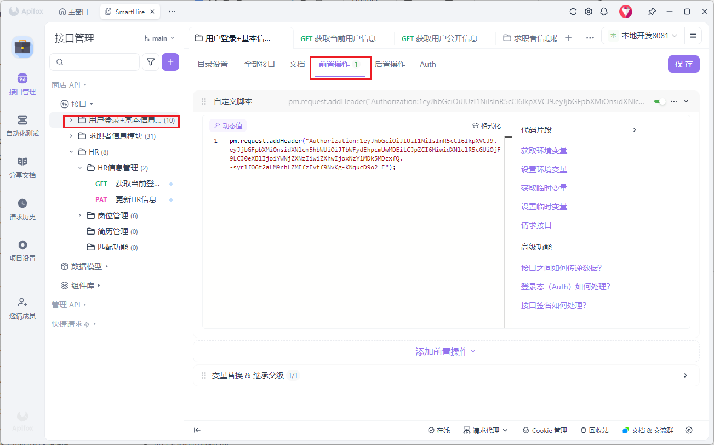

# SmartHire JWT 认证方案技术文档

参考链接

[jwt基础概念讲解](https://javaguide.cn/system-design/security/jwt-intro.html)

[jwt身份认证优缺点分析](https://javaguide.cn/system-design/security/advantages-and-disadvantages-of-jwt.html)

## 一、都需要看的部分

### 1. 用户登录流程

#### 1.1 登录接口

**接口地址：** `POST /smarthire/api/user-auth/login`

**请求体：**

```json
{
  "username": "SmartHire001",
  "password": "your_password"
}
```

**响应示例：**

```json
{
  "code": 0,
  "message": "登录成功",
  "data": {
    "accessToken": "eyJhbGciOiJIUzI1NiIsInR5cCI6IkpXVCJ9...",
    "refreshToken": "eyJhbGciOiJIUzI1NiIsInR5cCI6IkpXVCJ9...",
    "expiresIn": 604800
  }
}
```

#### 1.2 登录流程代码实现

后端登录逻辑位于 `UserAuthServiceImpl.login()` 方法：

```java
@Override
public LoginResponseDTO login(LoginDTO request) {
    User user = validateLoginRequest(request);

    user.setLastLoginAt(new Date());
    userMapper.updateById(user);

    Map<String, Object> claims = Map.of(
            "id", user.getId(),
            "username", user.getUsername(),
            "userType", user.getUserType());

    String accessToken = jwtUtil.generateAccessToken(claims);
    String refreshToken = jwtUtil.generateRefreshToken(claims);

    cacheRefreshTokenForSingleLogin(user.getId(), refreshToken);

    LoginResponseDTO resp = new LoginResponseDTO();
    resp.setAccessToken(accessToken);
    resp.setRefreshToken(refreshToken);
    resp.setExpiresIn(accessTokenValidTime / 1000);
    return resp;
}
```

**流程说明：**

1. 验证用户名和密码（`validateLoginRequest`）
2. 更新用户最后登录时间
3. 构建 JWT Claims（包含用户ID、用户名、用户类型）
4. 生成 Access Token 和 Refresh Token
5. 将 Refresh Token 缓存到 Redis（用于单点登录控制）
6. 返回 Token 信息

---

### 2. Access Token 和 Refresh Token 详解

#### 2.1 Token 配置

配置文件：`application-local.yml`

```yaml
jwt:
  secret-key: SmartHire  # JWT 签名密钥
  refresh-token-valid-time: 604800000  # Refresh Token 有效期：7天（毫秒）
  access-token-valid-time: 604800000  # Access Token 有效期：7天（毫秒）
  refresh-token-renew-threshold: 600000  # Refresh Token 续期阈值：10分钟（毫秒）
```

#### 2.2 Access Token 的作用和注意事项

**作用：**

- 用于访问所有需要认证的 API 接口
- 携带在请求头 `Authorization` 中
- 有效期较短（当前配置为7天，生产环境建议更短）

**注意事项：**

1. **必须使用 Access Token 访问受保护接口**

   - 如果使用 Refresh Token 访问，会返回错误：`TOKEN_IS_REFRESH_TOKEN`
2. **Token 过期后需要刷新**

   - 当 Access Token 过期时，需要使用 Refresh Token 调用刷新接口获取新的 Access Token
3. **Token 被加入黑名单后无法使用**

   - 登出时，Access Token 会被加入黑名单
   - 刷新 Token 时，旧的 Access Token 也会被加入黑名单

#### 2.3 Refresh Token 的作用和注意事项

**作用：**

- 用于刷新 Access Token
- 有效期较长（当前配置为7天）
- 支持单点登录控制

**注意事项：**

1. **不能用于访问受保护接口**

   - Refresh Token 只能用于调用 `/user-auth/refresh-token` 接口
2. **单点登录机制**

   - 系统使用 Redis 存储每个用户最新的 Refresh Token
   - 如果用户在另一处登录，之前的 Refresh Token 会失效
   - Redis Key 格式：`token:refresh:single:{userId}`
3. **自动续期机制**

   - 当 Refresh Token 剩余有效期小于 `refresh-token-renew-threshold`（10分钟）时，系统会自动生成新的 Refresh Token
   - 旧的 Refresh Token 会被加入黑名单

---

### 3. Token 黑名单机制

#### 3.1 黑名单的作用

黑名单机制用于在以下场景中使 Token 失效：

1. **用户登出**：登出时，Access Token 和 Refresh Token 都会被加入黑名单
2. **Token 刷新**：刷新时，旧的 Access Token 会被加入黑名单
3. **Refresh Token 续期**：续期时，旧的 Refresh Token 会被加入黑名单

#### 3.2 黑名单存储

使用 Redis 存储黑名单，Key 格式：

- Access Token 黑名单：`token:blacklist:access:{token}`
- Refresh Token 黑名单：`token:blacklist:refresh:{token}`

#### 3.3 黑名单检查

在 `JwtAuthenticationFilter` 中，每次请求都会检查 Access Token 是否在黑名单中：、

### 4.apifox调试说明

#### 4.1 添加前置操作

* 若token无效，或者需要切换用户，调用登录接口，获取token
* 在对应文件夹处，点击“前置操作”，添加自定义脚本，其中 “your-access-token”是你通过登录接口获取的accessToken
* 相当于给这个文件夹下方的接口都添加了Authorization请求头
* ```
  pm.request.addHeader("Authorization:your-access-token");
  ```



---

## 二、前端需要看的部分

### 1. Token 的存储和管理

#### 1.1 存储建议

**推荐方案：** 使用 `localStorage` 或 `sessionStorage` 存储 Token

**注意事项：**

- 不要将 Token 存储在 `cookie` 中（避免 CSRF 攻击）
- 如果使用 `localStorage`，注意 XSS 攻击防护
- 可以考虑使用加密存储

#### 1.2 Token 过期时间管理

前端需要记录 Token 的获取时间，并计算 Token 是否过期。建议在 Token 过期前 5 分钟自动刷新。

---

### 2. 定期刷新 Token

#### 2.1 刷新时机

**推荐策略：**

1. **定时刷新**：在 Token 过期前 5 分钟自动刷新
2. **请求前检查**：每次发起请求前检查 Token 是否即将过期
3. **错误时刷新**：当收到 1012 错误时，尝试刷新 Token 后重试请求

#### 2.2 刷新接口调用

**接口地址：** `POST /smarthire/api/user-auth/refresh-token`

**请求体：**

```json
{
  "refreshToken": "eyJhbGciOiJIUzI1NiIsInR5cCI6IkpXVCJ9..."
}
```

**响应示例：**

```json
{
  "code": 0,
  "message": "刷新成功",
  "data": {
    "accessToken": "新的 accessToken",
    "refreshToken": "新的或原有的 refreshToken",
    "expiresIn": 604800
  }
}
```

**注意事项：**

- 刷新成功后需要更新本地存储的 Token
- 如果刷新失败，需要清除本地 Token 并跳转到登录页
- 建议在 Token 过期前 5 分钟自动刷新，避免用户操作中断

---

### 3. 请求拦截器配置

#### 3.1 请求拦截器

前端需要在请求拦截器中自动添加 Token 到请求头 `Authorization` 中。

#### 3.2 响应拦截器

前端需要在响应拦截器中处理 Token 过期的情况：

- 当收到 1012 错误时，尝试使用 Refresh Token 刷新 Access Token
- 刷新成功后，使用新的 Access Token 重试原请求
- 刷新失败后，清除本地 Token 并跳转到登录页

---

### 4. 错误处理

#### 4.1 Token 相关错误码

根据后端 `ErrorCode` 枚举，前端需要处理的错误：

| 错误码 | 错误信息                   | 处理方式                         |
| ------ | -------------------------- | -------------------------------- |
| 1011   | JWT Token 为空             | 跳转到登录页                     |
| 1012   | JWT Token 无效             | 尝试刷新 Token，失败则跳转登录页 |
| 1017   | Refresh Token 已过期       | 跳转到登录页                     |
| 1018   | JWT Token 为 refresh token | 使用 Access Token 重新请求       |

#### 4.2 错误处理建议

- **TOKEN_IS_NULL (1011)** 和 **TOKEN_IS_INVALID (1012)**：尝试刷新 Token，刷新成功则重试请求，失败则跳转登录页
- **REFRESH_TOKEN_EXPIRED (1017)**：Refresh Token 已过期，直接清除本地 Token 并跳转登录页
- **TOKEN_IS_REFRESH_TOKEN (1018)**：使用了 Refresh Token 访问接口，需要重新获取 Access Token

---

## 三、后端需要看的部分

### 1. 从 Token 获取用户信息

#### 1.1 在 Service 层获取用户信息

**推荐方式：** 使用 `SecurityContextUtil.getCurrentClaims()` 获取当前用户的 Claims

```java
// UserAuthServiceImpl.getUserInfo()
@Override
public UserInfoDTO getUserInfo() {
    Map<String, Object> map = SecurityContextUtil.getCurrentClaims();
    Long userId = jwtUtil.getUserIdFromToken(map);
    if (userId == null) {
        throw new BusinessException(ErrorCode.USER_ID_NOT_EXIST);
    }
    User user = userMapper.selectById(userId);
    if (user == null) {
        throw new BusinessException(ErrorCode.USER_ID_NOT_EXIST);
    }

    UserInfoDTO userInfoDTO = new UserInfoDTO();
    BeanUtils.copyProperties(user, userInfoDTO);
    return userInfoDTO;
}
```

#### 1.2 SecurityContextUtil 工具类

```java
// SecurityContextUtil.java
public final class SecurityContextUtil {
    @SuppressWarnings("unchecked")
    public static Map<String, Object> getCurrentClaims() {
        Authentication authentication = SecurityContextHolder.getContext().getAuthentication();
        if (authentication == null) {
            return Collections.emptyMap();
        }
        Object principal = authentication.getPrincipal();
        if (principal instanceof Map<?, ?> map) {
            return (Map<String, Object>) map;
        }
        return Collections.emptyMap();
    }
}
```

#### 1.3 获取用户ID

```java
// 方式一：从 Claims 中获取
Map<String, Object> claims = SecurityContextUtil.getCurrentClaims();
Long userId = jwtUtil.getUserIdFromToken(claims);

// 方式二：直接使用 JwtUtil
Long userId = jwtUtil.getUserIdFromToken(SecurityContextUtil.getCurrentClaims());
```

#### 1.4 实际使用示例

在 `JobSeekerServiceImpl` 中的使用：

```java
@Override
public JobSeeker getSeekerInfo() {
    Map<String, Object> map = SecurityContextUtil.getCurrentClaims();
    Long userId = jwtUtil.getUserIdFromToken(map);

    // 验证用户是否存在
    User user = userAuthMapper.selectById(userId);
    if (user == null) {
        throw new BusinessException(ErrorCode.USER_ID_NOT_EXIST);
    }

    // 验证用户身份是否为求职者
    if (user.getUserType() != 1) {
        throw new BusinessException(ErrorCode.USER_NOT_SEEKER);
    }

    // 通过用户ID获取求职者信息
    JobSeeker jobSeeker = lambdaQuery()
            .eq(JobSeeker::getUserId, userId)
            .one();

    if (jobSeeker == null) {
        throw new BusinessException(ErrorCode.SEEKER_NOT_EXIST);
    }

    return jobSeeker;
}
```

---

### 2. JWT 工具类使用

#### 2.1 JwtUtil 主要方法

**生成 Token：**

```java
// 生成 Access Token
Map<String, Object> claims = Map.of(
    "id", user.getId(),
    "username", user.getUsername(),
    "userType", user.getUserType()
);
String accessToken = jwtUtil.generateAccessToken(claims);

// 生成 Refresh Token
String refreshToken = jwtUtil.generateRefreshToken(claims);
```

**验证 Token：**

```java
// 验证 Token（返回 DecodedJWT，包含完整信息）
DecodedJWT decoded = jwtUtil.verifyToken(token);

// 解析 Token（直接返回 Claims）
Map<String, Object> claims = jwtUtil.parseToken(token);
```

**提取信息：**

```java
// 从 DecodedJWT 中提取 Claims
Map<String, Object> claims = jwtUtil.getClaims(decoded);

// 从 Claims 中获取用户ID
Long userId = jwtUtil.getUserIdFromToken(claims);

// 判断 Token 类型
boolean isAccess = jwtUtil.isAccessToken(decoded);
boolean isRefresh = jwtUtil.isRefreshToken(decoded);

// 获取剩余有效时间（秒）
long expiresIn = jwtUtil.getExpiresInSeconds(decoded);
```

#### 2.2 完整使用示例

```java
@Service
public class MyService {
    @Autowired
    private JwtUtil jwtUtil;
  
    public void processToken(String token) {
        // 1. 验证 Token
        DecodedJWT decoded = jwtUtil.verifyToken(token);
    
        // 2. 检查 Token 类型
        if (!jwtUtil.isAccessToken(decoded)) {
            throw new BusinessException(ErrorCode.TOKEN_IS_REFRESH_TOKEN);
        }
    
        // 3. 提取用户信息
        Map<String, Object> claims = jwtUtil.getClaims(decoded);
        Long userId = jwtUtil.getUserIdFromToken(claims);
    
        // 4. 检查剩余有效时间
        long expiresIn = jwtUtil.getExpiresInSeconds(decoded);
        if (expiresIn < 60) { // 剩余时间少于1分钟
            // 可以考虑提示前端刷新 Token
        }
    
        // 5. 使用用户ID进行业务处理
        // ...
    }
}
```

---

### 3. 认证过滤器实现

#### 3.1 JwtAuthenticationFilter 工作原理

`JwtAuthenticationFilter` 继承 `OncePerRequestFilter`，在每次请求时执行：

```java
@Override
protected void doFilterInternal(HttpServletRequest request,
        HttpServletResponse response,
        FilterChain filterChain) throws ServletException, IOException {
    String path = request.getServletPath();
  
    // 1. 检查是否为公开路径
    if (PUBLIC_PATHS.contains(path)) {
        filterChain.doFilter(request, response);
        return;
    }

    String token = request.getHeader("Authorization");
    try {
        // 2. 检查黑名单
        ensureNotBlacklisted(token);
    
        // 3. 验证 Token
        DecodedJWT decoded = jwtUtil.verifyToken(token);
    
        // 4. 确保是 Access Token
        if (!jwtUtil.isAccessToken(decoded)) {
            log.warn("refresh token 访问受保护接口, path={} token={}", path, token);
            throw new BusinessException(ErrorCode.TOKEN_IS_REFRESH_TOKEN);
        }
    
        // 5. 提取 Claims 并设置到 SecurityContext
        Map<String, Object> claims = jwtUtil.getClaims(decoded);
        UsernamePasswordAuthenticationToken authentication = 
            new UsernamePasswordAuthenticationToken(claims, null, Collections.emptyList());
        SecurityContextHolder.getContext().setAuthentication(authentication);
    
        // 6. 继续过滤器链
        filterChain.doFilter(request, response);
    } catch (BusinessException ex) {
        SecurityContextHolder.clearContext();
        throw ex;
    } finally {
        SecurityContextHolder.clearContext();
    }
}
```

#### 3.2 公开路径配置

以下路径不需要 Token 认证：

```java
private static final Set<String> PUBLIC_PATHS = Set.of(
    "/user-auth/login",
    "/user-auth/register",
    "/user-auth/send-verification-code",
    "/user-auth/verify-code",
    "/user-auth/refresh-token"
);
```

---

### 4. 黑名单机制实现

#### 4.1 黑名单前缀定义

```java
// UserAuthServiceImpl.java
private static final String ACCESS_BLACKLIST_PREFIX = "token:blacklist:access:";
private static final String REFRESH_BLACKLIST_PREFIX = "token:blacklist:refresh:";
private static final String REFRESH_SINGLE_LOGIN_PREFIX = "token:refresh:single:";
```

#### 4.2 加入黑名单

**登出时：**

```java
@Override
public void logout() {
    String accessToken = getTokenFromRequest();
    Map<String, Object> claims = jwtUtil.parseToken(accessToken);
    Long userId = jwtUtil.getUserIdFromToken(claims);
  
    String refreshToken = getCurrentRefreshToken(userId);
  
    // Access Token 加入黑名单
    blacklistToken(accessToken, ACCESS_BLACKLIST_PREFIX, accessTokenValidTime);
  
    // Refresh Token 加入黑名单
    if (refreshToken != null) {
        blacklistToken(refreshToken, REFRESH_BLACKLIST_PREFIX, refreshTokenValidTime);
    }
  
    // 删除单点登录缓存
    redisTemplate.delete(REFRESH_SINGLE_LOGIN_PREFIX + userId);
}
```

**刷新 Token 时：**

```java
// 旧 Access Token 加入黑名单
String oldAccessToken = getTokenFromRequestNullable();
if (oldAccessToken != null) {
    blacklistToken(oldAccessToken, ACCESS_BLACKLIST_PREFIX, accessTokenValidTime);
}
```

**Refresh Token 续期时：**

```java
if (needRenewRefreshToken) {
    String newRefreshToken = jwtUtil.generateRefreshToken(claims);
    cacheRefreshTokenForSingleLogin(userId, newRefreshToken);
    // 旧 Refresh Token 加入黑名单
    blacklistToken(refreshToken, REFRESH_BLACKLIST_PREFIX, 
        TimeUnit.SECONDS.toMillis(refreshExpiresInSeconds));
    effectiveRefreshToken = newRefreshToken;
}
```

#### 4.3 黑名单检查

**在过滤器中检查：**

```java
// JwtAuthenticationFilter.ensureNotBlacklisted()
private void ensureNotBlacklisted(String token) {
    if (token == null || token.isBlank()) {
        throw new BusinessException(ErrorCode.TOKEN_IS_NULL);
    }
    if (Boolean.TRUE.equals(redisTemplate.hasKey(ACCESS_BLACKLIST_PREFIX + token))) {
        throw new BusinessException(ErrorCode.TOKEN_IS_INVALID);
    }
}
```

**在刷新 Token 时检查：**

```java
// UserAuthServiceImpl.ensureNotBlacklisted()
private void ensureNotBlacklisted(String token, String prefix) {
    if (Boolean.TRUE.equals(redisTemplate.hasKey(prefix + token))) {
        throw new BusinessException(ErrorCode.TOKEN_IS_INVALID);
    }
}
```

#### 4.4 单点登录机制

**缓存 Refresh Token：**

```java
private void cacheRefreshTokenForSingleLogin(Long userId, String refreshToken) {
    redisTemplate.opsForValue().set(
        REFRESH_SINGLE_LOGIN_PREFIX + userId,
        refreshToken,
        refreshTokenValidTime,
        TimeUnit.MILLISECONDS
    );
}
```

**验证单点登录：**

```java
private void ensureSingleLogin(String refreshToken, Long userId) {
    String key = REFRESH_SINGLE_LOGIN_PREFIX + userId;
    String latestRefresh = redisTemplate.opsForValue().get(key);
    if (latestRefresh == null || !latestRefresh.equals(refreshToken)) {
        throw new BusinessException(ErrorCode.TOKEN_IS_INVALID);
    }
}
```

**工作原理：**

1. 用户登录时，将 Refresh Token 存储到 Redis，Key 为 `token:refresh:single:{userId}`
2. 刷新 Token 时，检查传入的 Refresh Token 是否与 Redis 中存储的一致
3. 如果用户在另一处登录，新的 Refresh Token 会覆盖旧的，旧的 Refresh Token 将无法使用

---

## 总结

### 关键要点

1. **Token 类型区分**：Access Token 用于访问接口，Refresh Token 仅用于刷新
2. **黑名单机制**：登出、刷新、续期时都会将旧 Token 加入黑名单
3. **单点登录**：通过 Redis 存储最新 Refresh Token 实现单点登录控制
4. **自动续期**：Refresh Token 剩余时间少于阈值时自动续期
5. **安全获取用户信息**：后端统一使用 `SecurityContextUtil.getCurrentClaims()` 获取用户信息

### 配置建议

**生产环境配置建议：**

```yaml
jwt:
  secret-key: # 使用复杂的随机字符串
  refresh-token-valid-time: 604800000  # 7天
  access-token-valid-time: 3600000     # 1小时（建议更短）
  refresh-token-renew-threshold: 600000  # 10分钟
```

### 相关文件

- **JWT 工具类**：`com.SmartHire.common.utils.JwtUtil`
- **认证过滤器**：`com.SmartHire.common.filters.JwtAuthenticationFilter`
- **用户认证服务**：`com.SmartHire.userAuthService.service.impl.UserAuthServiceImpl`
- **安全上下文工具**：`com.SmartHire.common.utils.SecurityContextUtil`
- **配置文件**：`application-local.yml`
